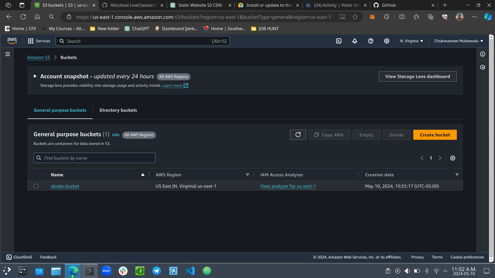
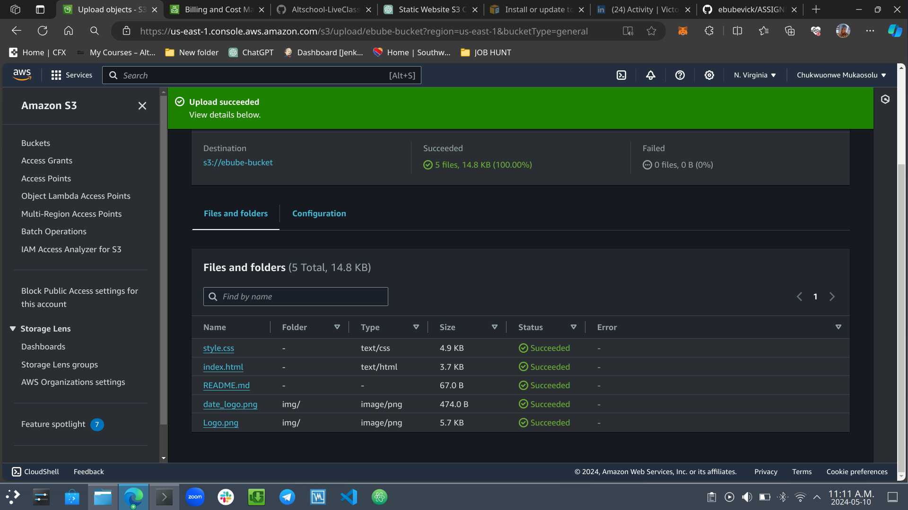
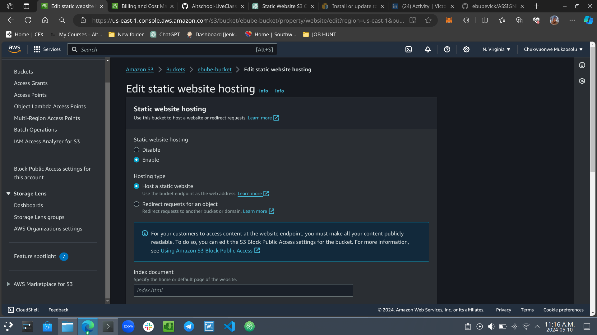
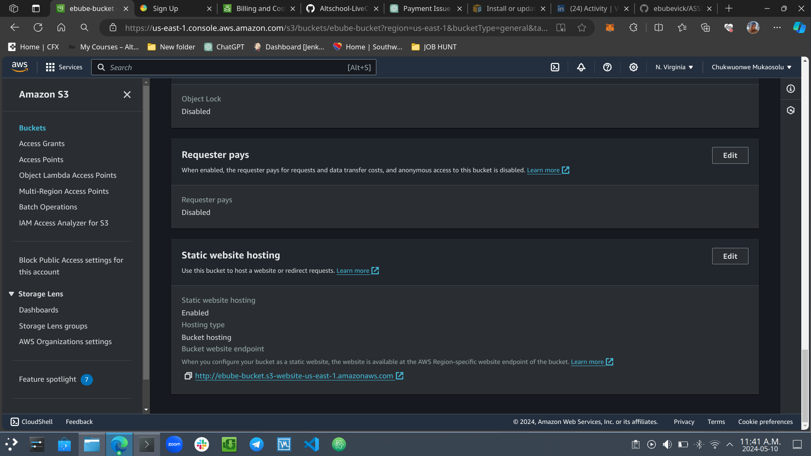
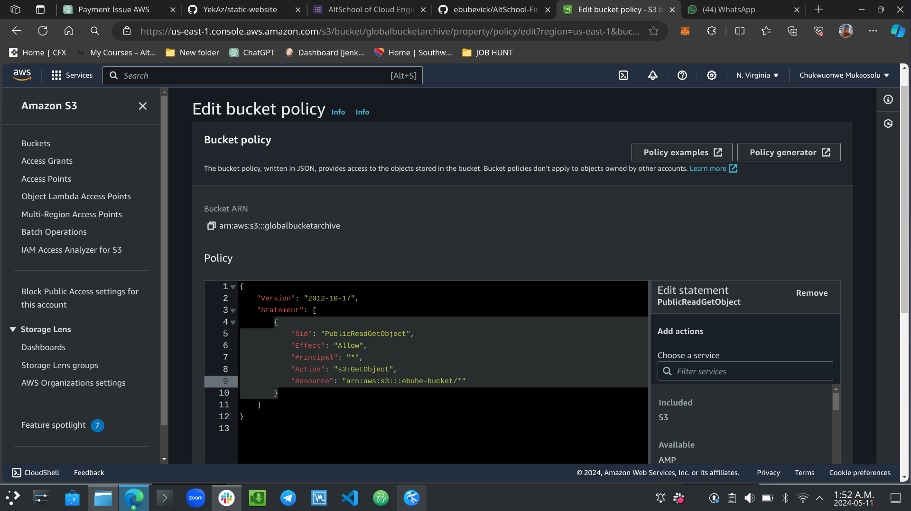
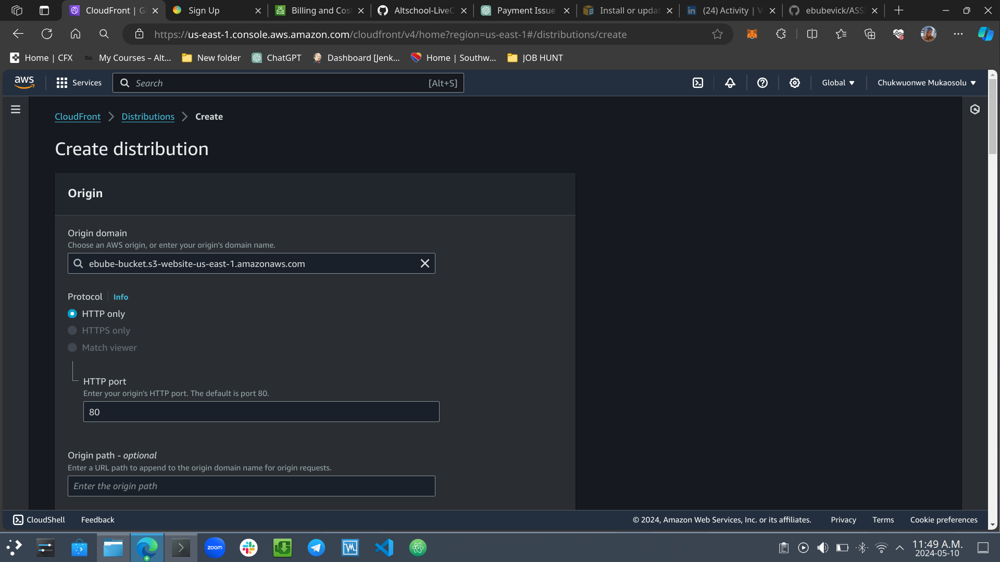
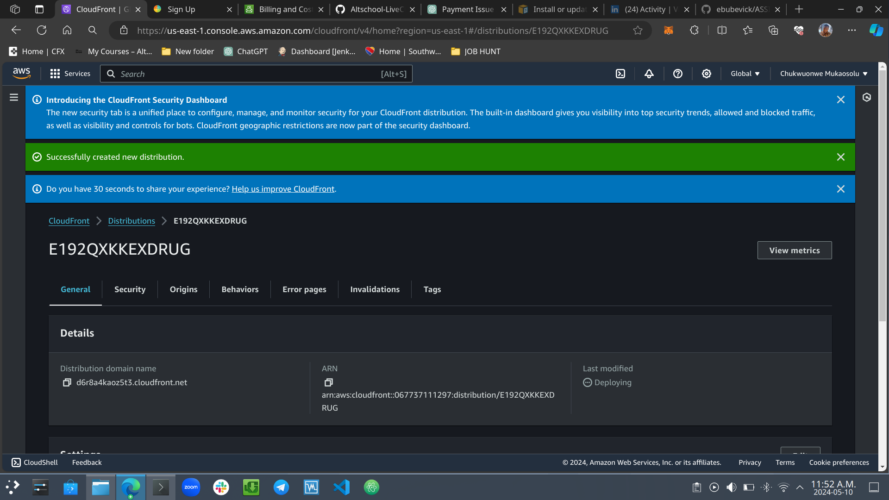
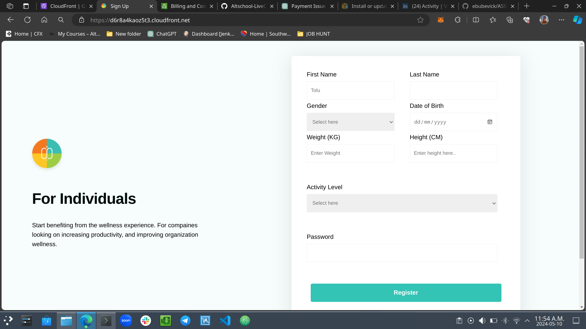

Hosting a Static Website on AWS S3 with CloudFront CDN

Introduction
This guide outlines the step-by-step process of creating and hosting a static website on Amazon S3 (Simple Storage Service) with a public read policy and leveraging CloudFront as a content delivery network (CDN) for enhanced performance and scalability.

Prerequisites
An AWS account with appropriate permissions to create S3 buckets, CloudFront distributions, and IAM policies.

Steps
Step 1: Create an S3 Bucket
Navigate to the Amazon S3 console.
Click on "Create bucket".
Specify a unique bucket name and select the desired region.
Keep default settings and click "Create bucket".

Step 2: Upload Website Files to S3
Open the newly created S3 bucket.
Click "Upload" and select the website files (HTML, CSS, JavaScript, images, etc.).
Complete the upload process.

Step 3: Enable Static Website Hosting
In the S3 bucket properties, locate the "Static website hosting" card.
Click "Edit".
Select "Use this bucket to host a website".
Enter the index document (e.g., index.html).
Optionally, specify an error document.
Save changes.

S3 Bucket End-point URL

Step 4: Set Bucket Policy for Public Read Access
In the S3 bucket properties, navigate to the "Permissions" tab.
Click "Bucket Policy".
Add a policy allowing public read access. Replace your-bucket-name with your bucket's name.

Copy code:

{
    "Version": "2012-10-17",
    "Statement": [
        {
            "Sid": "PublicReadGetObject",
            "Effect": "Allow",
            "Principal": "*",
            "Action": "s3:GetObject",
            "Resource": "arn:aws:s3:::your-bucket-name/*"
        }
    ]
}

Save the policy.

Step 5: Create a CloudFront Distribution
Navigate to the CloudFront console.
Click "Create Distribution".
Choose "Web" as the delivery method.
Set the S3 bucket as the "Origin Domain Name".
Configure other settings as desired (e.g., caching behavior, SSL).
Create the distribution.

CloudFront Deploying and Domain URL

Step 6: Update DNS (if necessary)
If using a custom domain, update DNS settings to point to the CloudFront distribution.

Step 7: Test Your Website
Wait for CloudFront distribution deployment.
Access the website via the CloudFront domain or custom domain if configured.

Static Website through S3 Bucket Endpoint URL

Static Website through CloudFront Domain

Conclusion
By following these steps, you have successfully created a static website hosted on an S3 bucket with public read access and leveraged CloudFront as a CDN for improved content delivery performance and scalability.
